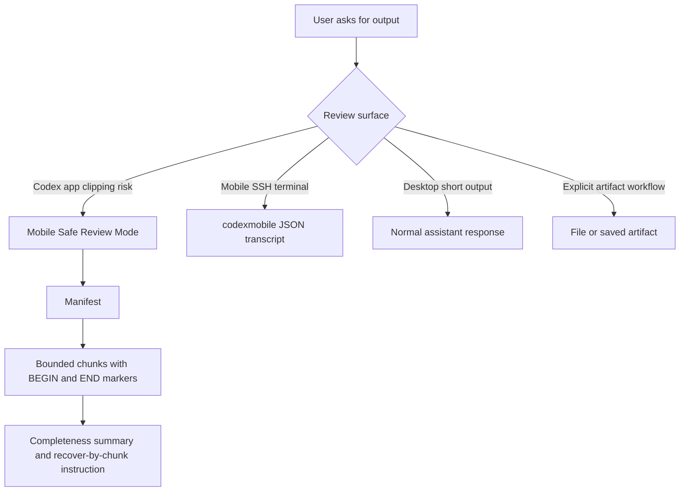

# Mobile Safe Review Mode - Plan

## Goal Capsule

- **Objective:** Make long or exact agent output reliably reviewable from Codex app surfaces when assistant-message rendering may temporarily or permanently clip content.
- **Product authority:** Codex Mobile is the current failing review surface; Codex Desktop appears to hydrate from a clipped preview to the full message, while Mobile does not reliably complete that hydration.
- **Open blockers:** The exact Codex assistant-message hydration behavior is not documented by OpenAI and must be treated as a renderer constraint until measured.

---

## Product Contract

### Summary

Mobile Safe Review Mode is a surface-aware output contract for exact review content.
It prevents invisible truncation by delivering bounded, self-checking inline chunks when a Codex app surface may clip assistant messages, while preserving `codexmobile` for mobile SSH terminal sessions and files for explicit artifact workflows.

### Problem Frame

The current local maxima are all partial fixes.
Writing a file is correct but breaks the mobile review workflow.
Running `codexmobile` fixes fullscreen terminal scrollback, but the current failure is happening inside the Codex app message renderer.
The observed difference is hydration behavior: Codex Desktop may show a clipped message briefly and then replace it with the full message, while Codex Mobile may remain stuck on the clipped version.

**Verified causal chain (2026-07-03, code + protocol probes, no speculation):**
1. The model emits the complete message — verified in the session rollout JSONL (all 100 test rows stored).
2. The Mac app-server serves the complete message at the hydration boundary — verified by speaking JSON-RPC `thread/read` (`includeTurns: true`) directly to a local app-server instance: full 100-row text returned.
3. Codex Desktop renders the streamed tail during the turn, then hydrates from that API — full message appears (user-observed).
4. The Codex iOS app receives the same complete payload but fails to render/hydrate large message items — it stays stuck on the streamed tail. This matches the open upstream bug family openai/codex#22705 ("iOS mobile thread opens with metadata but message hydration fails"; commenters: large threads fail on iOS/iPadOS, load fine on multiple Macs; small ones work). Open since May 2026, unfixed as of codex-cli 0.142.5.

Conclusion: only payload shape is controllable. The fix must keep every exact-review unit under the iOS render window, emitted as separate messages.

**Confirmed observations (2026-07-03, user testing on device):**
- The truncation is a tail window: only the bottom ~20-30 lines of a long assistant message survive on Codex Mobile. The head is lost, not the tail.
- Nothing marks the loss: the message starts mid-content with no "show more" affordance, fade, or truncation indicator. Truncation is invisible unless the reader knows what the beginning should have been.
- Force-closing the app and reopening the conversation does not recover the head on mobile. This rules out "missed final stream update" as the sole cause; the stored-message render path is also capped.
- Codex Desktop shows the same tail window during streaming, then hydrates to the full message when loading finishes.

Arbitrary chunking helps, but it is not systemic unless the agent knows when to enter the mode, how to mark completeness, and how the user can recover a missing chunk.
**Chunking inside a single message does not help at all:** a 100-line message with five labeled sections still renders as one bubble, and the tail window destroys the first four sections along with their markers. The chunk must be the renderer's own unit — a separate assistant message.

The product problem is not "how do we print 100 lines."
The product problem is "how do we make exact agent output trustworthy on a constrained review surface."

### Key Decisions

- **Review contract over renderer guessing.** The agent should not try to prove Codex Mobile has no inline limit; it should make each review unit small enough and marked enough that truncation is visible.
- **Chunk = separate assistant message.** Because the renderer tail-windows an entire bubble, the only chunk boundary that survives is a message boundary. Each chunk must be emitted as its own assistant message, interleaving a trivial tool action between chunks when the harness would otherwise merge them into one message. A message that fits entirely inside the ~20-30-line survival window cannot lose content even if it is tail-windowed.
- **Bottom-anchored completeness.** The head of a message is the lost region; the tail survives. Completeness markers, chunk labels, and recovery instructions must sit at the bottom of each unit. A manifest may open the response, but it must be its own short message (so it fits the window) and its facts must be repeated in the final chunk's footer.
- **Hydration divergence over mobile exceptionalism.** The failure should be framed as "some app surfaces do not reliably hydrate long assistant messages," not as proof that Mobile is an entirely separate product behavior.
- **Surface separation.** Codex app review, mobile SSH terminal review, desktop app review, and file/artifact review are different surfaces with different failure modes.
- **Human-verifiable completeness over machine-only hashes.** Counts, ranges, sentinels, and chunk labels are more useful on a phone than checksums the user cannot compute inline.
- **Durable instruction before product UI.** The first systemic fix should live as a reusable agent rule or skill; a richer `claude-browse` mobile/web review product can come later.

### Actors

- A1. **App-surface reviewer:** The user reviewing output inside Codex Mobile, and sometimes Codex Desktop, while avoiding file/app switching.
- A2. **Agent:** Codex or another coding agent that chooses the output format and recovers missing sections.
- A3. **Terminal helper:** `codexmobile`, used only when the user is in a mobile SSH terminal.
- A4. **Future review surface:** A possible `claude-browse` review card or mobile/web product that renders bounded work artifacts.

### Key Flows

- F1. App-surface exact-output response
  - **Trigger:** The user is on Codex Mobile, mentions truncation that does not hydrate to full content, or asks to review long exact content inline.
  - **Actors:** A1, A2
  - **Steps:** The agent classifies the content as exact-review, emits a short manifest, prints bounded chunks with `BEGIN` and `END` markers, and ends with a completeness summary.
  - **Outcome:** The user can tell from the phone whether every chunk arrived and can ask for one missing chunk by ID.

- F2. Mobile SSH terminal response
  - **Trigger:** The user is in a mobile SSH terminal or launches sessions through `claude-browse` under SSH.
  - **Actors:** A1, A2, A3
  - **Steps:** `claude-browse` routes Codex launches through `codexmobile`, which renders JSON events as plain transcript blocks.
  - **Outcome:** Terminal scrollback avoids fullscreen TUI redraw loss without changing Codex Mobile app behavior.

- F3. Recovery after suspected clipping
  - **Trigger:** The user says a chunk, range, or sentinel is missing.
  - **Actors:** A1, A2
  - **Steps:** The agent reprints only the requested chunk or adjacent range with the same chunk ID and boundaries.
  - **Outcome:** Recovery is local and low-friction instead of restarting the whole response.

### Requirements

**Surface Detection**

- R1. **(Revised 2026-07-03 after field failure.)** Detection-based entry is unreliable and must not gate the behavior: remote-control attaches to desktop-originated threads, session metadata carries no phone marker (observed `originator: codex-tui, source: vscode` on a phone-driven session), and the user does not announce the device. A live session with the rule loaded still emitted one 102-line message because no mobile signal was present. The mode is therefore UNCONDITIONAL for exact-review content longer than ~20 lines on every surface; prose is unaffected; the user can opt out per-request ("in one message"). Desktop pays a few extra message bubbles; mobile stops silently losing data.
- R2. The agent must not treat `codexmobile` success as proof that Codex app assistant-message rendering is fixed.
- R3. The agent must distinguish Codex app review from mobile SSH terminal review before recommending tools.
- R4. The agent must recognize the user's observed desktop behavior as delayed full-message hydration, not as evidence that the original message was never clipped.

**Content Classification**

- R5. The agent must classify output as exact-review when missing or reordered lines would materially change the result.
- R6. Exact-review content includes numbered lists, CSV-like rows, tables, code blocks, diffs, logs, acceptance criteria, and any user-requested "exactly this" output.
- R7. Normal prose can stay in ordinary assistant responses unless it becomes long enough that the user is reviewing structure rather than reading narrative.

**Inline Contract**

- R8. Each exact-review response in Mobile Safe Review Mode must open with a manifest emitted as its own separate short message, naming total chunks, expected item count when knowable, and the chunking rule used. The manifest's key facts (total chunks, final range) must be repeated in the final chunk's footer, because the head of any unit is the region that gets destroyed.
- R8a. Each chunk must be emitted as its own assistant message. When the harness would merge consecutive outputs into one message, the agent must interleave a trivial tool action (for example, a no-op shell command) between chunks to force separate messages.
- R9. Each chunk must include a visible `BEGIN CHUNK n/m` marker and a matching `END CHUNK n/m` marker, with the `END` marker carrying the full label and range — the bottom of the chunk is the guaranteed-visible region.
- R10. Each chunk must be recoverable by a stable label such as `CHUNK 3/4 ROWS 51-75`.
- R11. Sequential content must include range labels and preserve the original item numbers inside the chunk.
- R12. The final summary must state the number of chunks emitted, the expected final item or range, and how to request a reprint. It must be short enough to fit entirely within the survival window.

**Budgets**

- R13. The default mobile exact-output budget is at most 15 to 20 lines or roughly 1,000 to 1,200 characters per message — comfortably inside the observed ~20-30-line survival window, so a tail-windowed bubble still shows the entire chunk.
- R14. Code and diffs should chunk by semantic unit when possible, such as function, file hunk, or section, rather than by arbitrary line count.
- R15. Markdown tables should be avoided in Mobile Safe Review Mode unless the table is small; key-value or bullet formats are preferred on mobile.

**Durability**

- R16. The behavior should be captured in a durable Codex instruction surface so future sessions do not rediscover it from chat history.
- R17. The durable rule should prefer inline mobile-safe chunks over file output when the user asks to review directly on mobile.
- R18. `claude-browse` should keep `codexmobile` scoped to SSH/TUI sessions unless a future feature deliberately builds a mobile/web review card surface.

### Acceptance Examples

- AE1. **Covers R1, R8, R8a, R9, R11.** Given the user says "I am on Codex Mobile" and asks for rows 1 through 100, when the agent responds, then it emits a short manifest message followed by five to seven marked chunks, each as its own assistant message of at most 20 lines — never as sections inside one long bubble.
- AE2. **Covers R2, R3.** Given `codex remote-control` is connected and `codexmobile` tests pass, when the user still sees mobile app clipping, then the agent does not claim the daemon or terminal helper solved app rendering.
- AE3. **Covers R4.** Given Codex Desktop briefly clips and then shows the full message, when the agent diagnoses the issue, then it identifies delayed hydration as part of the rendering model rather than dismissing the screenshot as transient.
- AE4. **Covers R10, R12.** Given the user says "chunk 3 disappeared," when the agent recovers, then it reprints only chunk 3 with the same range and markers.
- AE5. **Covers R14.** Given the exact output is a code review with three findings, when the agent chunks for mobile, then each finding stays whole instead of being split mid-evidence.

### Success Criteria

- The user can review exact output inside Codex Mobile without opening files for ordinary cases.
- Missing content is detectable from visible markers and counts, not guessed from memory.
- The agent no longer recommends `codexmobile` as the app-renderer fix.
- The agent can explain the desktop/mobile difference as a likely hydration divergence.
- Future sessions apply Mobile Safe Review Mode without the user re-explaining the truncation history.

### Scope Boundaries

- **In scope:** Agent response policy, durable instruction capture, recovery protocol, and optional future `claude-browse` review-card requirements.
- **Deferred for later:** Measuring exact Codex Mobile renderer limits across devices, OS versions, and app versions.
- **Outside this fix:** Changing the ChatGPT/Codex app renderer itself, bypassing the mobile app with file-only workflows, or treating mobile SSH terminal behavior as the same issue.

### Dependencies / Assumptions

- **One verification still open:** the multi-message test — several consecutive short assistant messages in one turn must each render as their own bubble on Codex Mobile. The design is robust to either outcome (a message under the survival window cannot lose content even if tail-windowed), but if consecutive messages get visually merged, interleaved tool actions (R8a) are mandatory rather than conditional. User is running this test on device.
- Codex Mobile remote control remains the user's preferred review surface.
- The agent cannot directly introspect whether a Codex app surface has finished hydrating a long message.
- The user-observed desktop/mobile difference is reliable enough to treat as a product signal, even without a screenshot available in this session's current context.
- OpenAI's public Codex remote-connection docs describe mobile review capabilities but do not specify assistant-message size or hydration guarantees.

### Sources / Research

- `claude_browse/codex_mobile_json.py` documents the existing terminal-specific fix: avoiding Codex's interactive TUI by rendering `codex exec --json` as plain transcript blocks.
- `claude_browse/browse.py` routes Codex sessions through `codexmobile` only when SSH and TTY conditions indicate mobile terminal use.
- `tests/test_codex_mobile_json.py` and `tests/test_browse.py` verify the local terminal helper and SSH routing behavior.
- `ROADMAP.md` already frames future paid work around cross-device sync, mobile/web browsing, and shared work artifacts.
- OpenAI Codex Remote Connections docs establish that Codex Mobile can review outputs, diffs, terminal output, and screenshots, but they do not define a no-truncation guarantee for one long assistant message.
