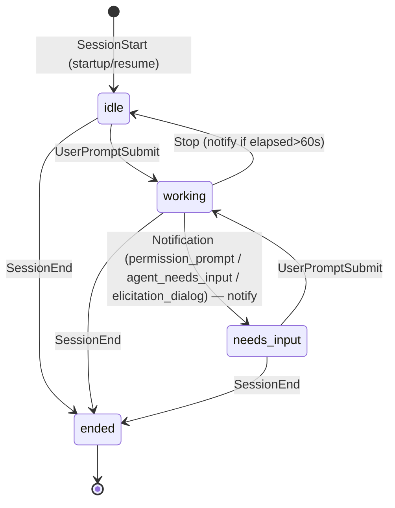
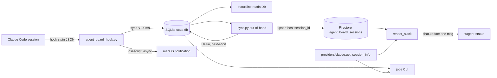

# feat: Agent thread status board for Claude Code sessions

**Target repo:** `claude-browse` (`~/claude-browse`). All repo-relative paths below are relative to that repo. Two paths live outside any repo and are called out explicitly: `~/.claude/settings.json` (machine config) and `~/.zshrc` (shell rc).

---

## Summary

Turn every Claude Code session into a tracked "task" with a live state (`working` / `idle` / `needs-input` / `ended`) and an auto-derived human name, so Shamanth can close terminal windows without losing track and get pushed a notification when a thread finishes or needs him — across two laptops.

The insight from research: `claude-browse` already discovers sessions (`providers/claude.py` reads every `~/.claude/projects/**/*.jsonl`, extracting `cwd`, `first_msg`, `ai-title`, `last_timestamp`) and already builds a resume command (`native_resume_prefix=("claude","--resume")`) and a restart card (`work_state.py`). The **only** missing pieces are (1) **live state**, which lives nowhere on disk today, and (2) an **auto-name** driving push surfaces. We add those two, keyed on `session_id`, and reuse everything else.

Architecture in one line: **Claude Code hooks write state to a local SQLite store (fast, hot path) → statusline + native macOS notification read/fire locally → an out-of-band syncer pushes state to Firestore and rewrites one Slack `#agent-status` message (cross-laptop) → a `jobs` CLI + tmux `work`/`jobs` aliases give frictionless glance + reattach.**

---

## Problem Frame

**The pain today:** 7-8 concurrent Claude Code windows across two laptops. Long autonomous runs (Fable, hours) hold terminals hostage. No session tells you anything, so the only way to learn a thread's state is to open its window — polling. Polling is the distraction. Three windows in the same folder are indistinguishable. Coming back to a thread from days ago means hunting.

**Why now:** `claude-browse` solved *find + resume* but has no concept of *state* or *human identity*, so it can't answer "which of my 8 threads is done / stuck on me / still churning?" — the actual question.

**One-sentence feature:** Every Claude Code session becomes an auto-named, live-state task visible on a single board (terminal + Slack) that pings you natively when it finishes or blocks on you, and that you re-enter with one copy-pasted command.

---

## Requirements

- **R1** — Each session has a **live state**: `working` (agent running), `idle` (turn done, ball in your court), `needs-input` (blocked on a permission prompt or an agent question), `ended` (session closed). State transitions are driven by Claude Code hooks, never by polling jsonl.
- **R1b (liveness)** — State must be **observed, not claimed**: sessions killed without a `SessionEnd` (force-quit terminal, laptop sleep, tmux kill — the common case with 8 windows) must not linger as `working`. The statusline acts as a **heartbeat** (`heartbeat_at` stamped every ~5s via `refreshInterval`); any non-`ended` row whose heartbeat is older than ~10 min renders as `gone` on every board surface. A board that lies gets ignored — this requirement is what keeps it trustworthy.
- **R2** — Each session has an **auto-derived name** (no manual labeling). Provisional name is instant (from first user prompt, zero API); upgraded once to a ~5-word Haiku synthesis, out-of-band, best-effort, cached.
- **R3** — **Native macOS notification** fires on: `needs-input` (always), and `working→idle` **only when the turn ran >60s** (long run finished) — so active back-and-forth does not spam.
- **R4** — The session's name + state appear in the **Claude Code statusline** (fast, local read only — never network/API).
- **R5** — A **`jobs` terminal command** lists all active sessions across states with, per row, a copy-paste **resume command** (`claude --resume <id>` for that session's cwd). A **`work <name>`** command attach-or-creates a named tmux session for frictionless detach/reattach.
- **R6** — A **Slack `#agent-status` board** (single message, updated in place) shows all active sessions **across both laptops**, each with name, state, host, and resume command. Automated post → **bot token** (per team norm; automated posts stay bot).
- **R7** — **Cross-laptop**: state syncs via Firestore (both laptops write; the board reads the union).
- **R8** — **Hooks must never break or slow a session**: every hook exits 0, wraps its body in try/except, does local work synchronously in <100ms, and offloads network (Firestore/Slack) to `async` hooks or a separate syncer.
- **R9** — Works **offline** and **without the team-operations venv**: naming and sync degrade gracefully (provisional name stays; sync is skipped) when Anthropic/Firestore/Slack creds or network are absent.

---

## Concrete Scenarios (Feature Clarity)

- **S1 (happy, long run):** Shamanth submits a prompt to a Fable-style thread, detaches the tmux window, walks away. 40 min later the agent finishes. `Stop` hook fires, elapsed >60s → macOS notification "✅ generator-priyansha-fix — done". Firestore updated; Slack board row flips to `idle`. He clicks the window later, or copies the resume command from Slack.
- **S2 (happy, blocked):** A thread hits a permission prompt — or Claude stops mid-run to ask a question (`elicitation_dialog`/`agent_needs_input`). `Notification` hook → state `needs-input` → macOS notification "⏸️ rtst-playbook — needs your input". Slack row flips to `needs-input` (louder icon). He goes straight to that window.
- **S2b (no idle spam):** He reads a response for 3 minutes without typing. Claude Code fires `idle_prompt` notifications — the hook **ignores** them (state stays `idle`, no banner). "You haven't typed for 60s" is not "the agent needs you"; mapping it to `needs-input` would ping every unanswered turn across 8 sessions and get the whole system disabled within a day.
- **S3 (active iteration, no spam):** He's actively chatting in a thread; each turn takes 8s. `Stop` fires each turn but elapsed <60s → **no** notification. Statusline shows `working`→`idle` per turn. Board shows `idle`.
- **S4 (7-day-old thread):** He runs `jobs` (or reads Slack). The thread from last week shows `ended` with resume command `claude --resume <id>`. He pastes it in any terminal; `claude-browse`'s existing resume relocates to the original cwd. tmux is irrelevant (process long dead) — this is resume, not reattach.
- **S5 (three windows, same folder):** Three sessions in `team-operations`. Board shows three distinct rows keyed by `session_id`, each with its own auto-name. No collision.
- **Edge (no first prompt yet):** `SessionStart` fires before any prompt → record created, state `idle`, name = provisional placeholder (`"(new session)"` or cwd basename) until first prompt arrives.
- **Edge (parallel sessions writing store):** 8 sessions' hooks write SQLite concurrently → WAL mode + short busy_timeout handle it; no corruption, last-writer-wins per row (rows are per-session, so no cross-session contention).
- **Edge (zombie session):** He force-quits a terminal mid-run (no `SessionEnd` fires). The row is stuck at `working` — but its heartbeat stops. After ~10 min every board surface renders it `gone` (with the resume command still shown, since resume works fine on a dead process). The board never shows a dead thread as alive (R1b).
- **Failure (Haiku down / offline):** Namer call raises → caught; provisional first-prompt name stays; `name_source` stays `provisional` so a later sync retries. Session unaffected.
- **Failure (Firestore/Slack creds missing):** Syncer catches, logs to a local file, no-ops. Local loop (statusline, notifications, `jobs`) fully works. Hooks unaffected (R8).
- **Failure (hook script throws):** try/except → exit 0. Claude Code shows no error; session continues. Worst case: that one transition is missed; the next transition self-heals the state.

---

## Key Technical Decisions

| # | Decision | Chosen | Why | Reversible? |
|---|----------|--------|-----|-------------|
| KTD1 | State store | **Local SQLite** (`~/.claude/agent-board/state.db`, WAL) as source of truth for the hot path; Firestore as cross-laptop mirror | SQLite is stdlib, atomic, concurrent-safe across 8 sessions, zero-latency for statusline/hooks. JSON files race under concurrent writers. | Yes (swap store.py internals) |
| KTD2 | Where naming/sync run | **Out-of-band**, never in the hot hook path | Hooks must be <100ms and offline-safe (R8, R9). Haiku + Firestore + Slack are network. | Yes |
| KTD3 | Naming | **Provisional (first prompt, instant) → Haiku upgrade (cached, best-effort)** | Zero-effort identity (R2) that never blocks and degrades offline. Reuses `claude-browse` first_msg extraction. | Yes |
| KTD4 | Stop notification gating | **Notify only if turn elapsed >60s** | Kills spam during active iteration; pings only long-run completion (the Fable case, S1 vs S3). | Yes (tune threshold) |
| KTD5 | Code home | **Extend `claude-browse`** | Owns session discovery, provider layer, `native_resume_cmd`, `work_state.py`; is a git repo with tests. | Costly (chosen deliberately) |
| KTD6 | Slack board mechanism | **One message, `chat.update`** via bot token; message `ts` stored in Firestore meta doc | In-place update = the "air-traffic" board; bot token per team norm for automated posts. Canvas/MCP unreliable headless. | Yes |
| KTD7 | Cross-laptop identity | Doc id = `f"{hostname}:{session_id}"`; `host` shown on board | Distinguishes the two laptops; avoids id collision. | Yes |
| KTD8 | Naming cost tracking | `try: from team_ops.ai_usage import tracked_anthropic_client` else raw `anthropic` | Honors CLAUDE.md cost rule when importable; still works standalone (R9). ~$0.0001/session. | Yes |

---

## High-Level Technical Design

### State machine (per session, driven by hooks)



**Explicitly ignored Notification types:** `idle_prompt` (fires whenever the user hasn't typed for ~60s — mapping it to `needs-input` would spam a banner for every unanswered turn, S2b), `auth_success`, `elicitation_complete`/`elicitation_response`, `agent_completed` (Stop already covers completion with the duration gate).

**Liveness overlay (R1b):** orthogonal to hook-driven state — the statusline stamps `heartbeat_at` every ~5s while the process is alive. Board rendering derives `gone` for any non-`ended` row with `now - heartbeat_at > 10 min`. `gone` is a *display* state, not a stored one: if the session was merely suspended (laptop slept) and wakes, the heartbeat resumes and the row self-heals to its stored state with no writeback needed.

### Data flow



**Trigger cadence for network sync (R8):** The `async` sync hook fires on `Stop`, `Notification`, `SessionEnd` (state-change events, ~1 per turn), not on statusline refresh or keystrokes. Slack `chat.update` is well within tier-3 rate limits at that cadence.

---

## Output Structure

```
claude-browse/
├── claude_browse/
│   ├── board/                      # NEW module
│   │   ├── __init__.py
│   │   ├── store.py                # SQLite state store (U1)
│   │   ├── hook.py                 # hook dispatcher entrypoint (U2)
│   │   ├── statusline.py           # statusline renderer (U3)
│   │   ├── notify.py               # macOS notification helper (U2)
│   │   ├── naming.py               # Haiku auto-namer (U5)
│   │   ├── sync.py                 # Firestore + Slack sync (U7, U8)
│   │   └── cli.py                  # `jobs` board renderer (U6)
├── agent-board                     # NEW entry script (symlink target for ~/.local/bin/jobs)
├── shell/agent-board.zsh           # NEW: work()/jobs() shell functions to source (U6)
└── tests/
    ├── test_board_store.py         # U1
    ├── test_board_hook.py          # U2
    ├── test_board_statusline.py    # U3
    ├── test_board_naming.py        # U5
    └── test_board_sync.py          # U7/U8
```

Outside the repo (machine config, edited in place, backed up first):
- `~/.claude/settings.json` — `hooks` + `statusLine` keys (U2, U3)
- `~/.zshrc` — source `shell/agent-board.zsh` (U6)

---

## Implementation Units

### U1. SQLite state store

**Goal:** The single local source of truth for session state, safe under 8 concurrent writers.
**Requirements:** R1, R8. **Dependencies:** none.
**Files:** `claude_browse/board/store.py`, `claude_browse/board/__init__.py`, `tests/test_board_store.py`

**Approach:** SQLite at `~/.claude/agent-board/state.db`. Open with `PRAGMA journal_mode=WAL` and `PRAGMA busy_timeout=3000`. Create dir + table on first use (idempotent `CREATE TABLE IF NOT EXISTS`). One row per session.

Schema:
```
sessions(
  session_id   TEXT PRIMARY KEY,
  host         TEXT,
  cwd          TEXT,
  name         TEXT,
  name_source  TEXT,     -- 'provisional' | 'haiku'
  state        TEXT,     -- 'working'|'idle'|'needs-input'|'ended'
  working_since REAL,    -- epoch set on working; used for U2 duration gate
  heartbeat_at REAL,     -- stamped by statusline every ~5s (R1b liveness)
  updated_at   REAL,
  msg_count    INTEGER
)
```

Functions:
- `get_conn() -> sqlite3.Connection` — WAL, busy_timeout, ensures dir+table.
- `upsert(session_id: str, **fields) -> None` — INSERT ... ON CONFLICT(session_id) DO UPDATE, always bumps `updated_at`.
- `get(session_id: str) -> dict | None`
- `active(max_age_hours: float = 24) -> list[dict]` — rows with `state != 'ended'` OR `updated_at` within window, newest first.
- `set_state(session_id, state, *, cwd=None, working_since=None) -> None`
- `heartbeat(session_id: str) -> None` — single UPDATE of `heartbeat_at` (cheap; called from statusline).
- `display_state(row: dict, *, stale_after_s: int = 600) -> str` — pure function: returns `'gone'` for a non-`ended` row whose `heartbeat_at` (or `updated_at` if never heartbeated) is older than the threshold, else the stored state. Every renderer (statusline excluded — it's the live session itself — but `jobs` CLI and Slack board included) goes through this.

**Patterns to follow:** stdlib `sqlite3` only; mirror the defensive try/except + `Path.home()` style in `claude_browse/providers/claude.py`.

**Test scenarios:**
- Happy: `upsert(new id, state='idle')` then `get` returns the row with that state and a non-null `updated_at`.
- Happy: `set_state(id,'working', working_since=t)` then `set_state(id,'idle')` — row shows `idle`, `working_since` preserved for the elapsed calc.
- Edge: `active()` excludes an `ended` row older than the window, includes a recent `idle` row, orders newest-first.
- Edge/concurrency: two connections `upsert` different `session_id`s in a tight loop → both rows present, no `database is locked` error (WAL + busy_timeout).
- Liveness: row with `state='working'` and `heartbeat_at` 20 min old → `display_state` returns `'gone'`; same row with fresh heartbeat → `'working'`; `ended` row never becomes `gone` (R1b, zombie edge).
- Failure: `get(unknown id)` → `None`.

**Verification:** `pytest tests/test_board_store.py` green; manual: write a row, `sqlite3 state.db 'select * from sessions'` shows it.

---

### U2. Hook dispatcher + native notifications

**Goal:** One entrypoint that Claude Code hooks call; routes by `hook_event_name`, writes state, fires gated notifications. Never breaks a session.
**Requirements:** R1, R3, R8. **Dependencies:** U1.
**Files:** `claude_browse/board/hook.py`, `claude_browse/board/notify.py`, `tests/test_board_hook.py`, plus `~/.claude/settings.json` (machine config)

**Approach:** `hook.py` reads all of stdin, `json.loads`, dispatches on `hook_event_name`. **Entire body wrapped in try/except; always `sys.exit(0)`.** Verified stdin fields (from official docs): common `session_id`, `cwd`, `hook_event_name`; `SessionStart.source`; `UserPromptSubmit.prompt`; `Stop.last_assistant_message`; `Notification.notification_type` ∈ {`permission_prompt`,`idle_prompt`,`auth_success`,`agent_needs_input`,`agent_completed`,...}; `SessionEnd.reason`.

Routing:
- `SessionStart` → `upsert(session_id, host, cwd, state='idle', name=provisional_from_transcript_or_placeholder, name_source='provisional')` if new.
- `UserPromptSubmit` → capture provisional name from `prompt` if still placeholder; `set_state('working', working_since=now)`.
- `Stop` → `set_state('idle')`; read prior `working_since`; if `now - working_since > 60` → `notify("✅ done", name)`.
- `Notification` → if `notification_type` in {`permission_prompt`,`agent_needs_input`,`elicitation_dialog`} → `set_state('needs-input')` + `notify("⏸️ needs your input", name)`. **Ignore** `idle_prompt` (fires on every ~60s of user inactivity — spam trap, S2b), `auth_success`, `elicitation_complete`/`elicitation_response`, `agent_completed`.
- `SessionEnd` → `set_state('ended')`.

`notify.py`: `notify(title: str, message: str) -> None` → `subprocess.run(["osascript","-e", f'display notification {json-quoted message} with title {json-quoted title}'], timeout=5)`, wrapped try/except. (osascript is built-in; no dependency.)

**settings.json wiring** (registered per verified schema; Stop/Notification/SessionEnd also get an `async` sibling in U7 for network sync):
```json
{"hooks":{
  "SessionStart":[{"hooks":[{"type":"command","command":"<abs>/agent-board hook","timeout":10}]}],
  "UserPromptSubmit":[{"hooks":[{"type":"command","command":"<abs>/agent-board hook","timeout":10}]}],
  "Stop":[{"hooks":[{"type":"command","command":"<abs>/agent-board hook","timeout":10}]}],
  "Notification":[{"hooks":[{"type":"command","command":"<abs>/agent-board hook","timeout":10}]}],
  "SessionEnd":[{"hooks":[{"type":"command","command":"<abs>/agent-board hook","timeout":10}]}]
}}
```
The dispatcher gets the event from the stdin `hook_event_name`, so one command serves all events. **Back up `settings.json` before editing.**

**Execution note:** Back up `~/.claude/settings.json`; add hooks; verify on THIS session before trusting. A broken Stop hook would fire on every turn.

**Test scenarios:**
- Happy: feed a `Stop` JSON with `working_since` 90s ago → state `idle` AND `notify` called once (mock `notify`).
- Happy: feed `Stop` with `working_since` 8s ago → state `idle`, `notify` NOT called (S3).
- Happy: `Notification` with `notification_type='permission_prompt'` → state `needs-input`, `notify` called (S2). Same for `elicitation_dialog` and `agent_needs_input`.
- Edge: `Notification` with `notification_type='idle_prompt'` → **no state change, no notify** (S2b spam guard). Same for `auth_success`.
- Edge: `SessionStart` for unknown id with no transcript → row created, state `idle`, placeholder name (no crash).
- Failure: malformed/empty stdin → caught, exit code 0 (assert process returns 0), no row written.
- Integration: pipe a real `UserPromptSubmit` then `Stop` JSON through the actual entry script → DB shows working→idle transition.

**Verification:** Add hooks; submit a prompt in a live session; `jobs`/sqlite shows `working` then `idle`; a >60s task yields a real macOS banner; malformed input never surfaces a hook error in the UI.

---

### U3. Statusline renderer

**Goal:** Show `name · state` in the Claude Code statusline, reading only local SQLite (fast).
**Requirements:** R4. **Dependencies:** U1.
**Files:** `claude_browse/board/statusline.py`, `tests/test_board_statusline.py`, plus `~/.claude/settings.json`

**Approach:** Reads statusline stdin JSON (verified fields: `session_id`, `cwd`, `model.display_name`, `workspace.current_dir`). `store.get(session_id)` → print one line, e.g. `◇ generator-priyansha-fix · working` with an ANSI color per state (working=cyan, idle=green, needs-input=yellow, ended=dim). No record → fall back to `basename(cwd)`. **Never** calls network/Haiku (R4). Must return in well under the statusline budget.

**Heartbeat duty (R1b):** each invocation also calls `store.heartbeat(session_id)` — one cheap local UPDATE. With `refreshInterval: 5`, a live session stamps every ~5s; a killed one stops stamping, which is what lets every board surface derive `gone`. This is the liveness signal for the whole system, and it costs one SQLite write per 5s per session (trivial under WAL).

settings.json:
```json
{"statusLine":{"type":"command","command":"<abs>/agent-board statusline","padding":0,"refreshInterval":5}}
```

**Test scenarios:**
- Happy: DB has `id→(name='foo', state='working')`; feed statusline JSON with that `session_id` → stdout contains `foo` and `working`, AND `heartbeat_at` was bumped (R1b).
- Edge: no DB row → stdout falls back to cwd basename, exit 0.
- Edge: `needs-input` state → yellow ANSI code present.
- Failure: malformed stdin → prints empty/fallback, exit 0 (never breaks the status bar).

**Verification:** Configure statusLine; the bottom bar of THIS session shows the name+state and updates working→idle across a turn.

---

### U4. Auto-namer (Haiku, out-of-band, cached)

**Goal:** Upgrade provisional names to a ~5-word Haiku synthesis, once per session, best-effort.
**Requirements:** R2, R9, KTD8. **Dependencies:** U1.
**Files:** `claude_browse/board/naming.py`, `tests/test_board_naming.py`

**Approach:** `compute_name(session_id) -> str | None`. Loads `providers.claude.get_session_info` for `first_msg`/`last_msg`. Builds a tiny prompt: "Summarize this coding session in 4-6 words, lowercase kebab-ish, no punctuation: <first_msg>". Model `claude-haiku-4-5-20251001`, `max_tokens≈20`. Client resolution (KTD8): `try: from team_ops.ai_usage import tracked_anthropic_client; client = tracked_anthropic_client("agent_board")` `except Exception:` raw `anthropic.Anthropic()`. On any exception → return `None` (caller keeps provisional). `maybe_name(session_id)` — only runs when `name_source != 'haiku'`; on success `upsert(name=..., name_source='haiku')`. Prefer existing `ai-title`/`custom-title` from `get_session_info` when present (skip the call entirely).

**Execution note:** best-effort; never raises to caller. Offline path must be exercised (mock ImportError + API error).

**Test scenarios:**
- Happy: `get_session_info` returns a `first_msg`; mock client returns "fix generator priyansha feedback" → `upsert` called with `name_source='haiku'`.
- Edge: session already has `ai-title` → returns it without calling the model (assert client not called).
- Failure: `tracked_anthropic_client` import raises AND raw client raises → `compute_name` returns None, provisional name untouched.
- Idempotency: second `maybe_name` on a `haiku`-sourced row is a no-op (no client call).

**Verification:** Run the namer against a real recent session; DB name flips from provisional to a coherent 5-word phrase; `name_source='haiku'`; second run makes no API call.

---

### U5. `jobs` board CLI + tmux `work`/`jobs` aliases

**Goal:** One terminal glance at all active sessions with copy-paste resume commands; frictionless tmux detach/reattach.
**Requirements:** R5. **Dependencies:** U1, and `providers/claude` (existing).
**Files:** `claude_browse/board/cli.py`, `agent-board` (entry script), `shell/agent-board.zsh`, plus `~/.zshrc`

**Approach:** `agent-board` entry script dispatches subcommands: `hook`, `statusline`, `board`/`jobs`, `sync`. `cli.render_board()` reads `store.active()`, maps each row through `store.display_state` (so zombies show `gone`, R1b), and for each row builds the resume command from the provider: `claude --resume <session_id>` (prefix from `providers.claude.PROVIDER.native_resume_prefix`). Prints an aligned table: state icon · name · host · cwd basename · resume cmd. Sorted needs-input → working → idle → gone/ended.

`shell/agent-board.zsh`:
```zsh
work(){ tmux new-session -A -s "$1"; }         # attach-or-create named session
jobs(){ command agent-board board; }            # note: shadows builtin `jobs`; alias as `aj` if unwanted
```
Sourced from `~/.zshrc`. Symlink `~/.local/bin/agent-board -> ~/claude-browse/agent-board` (mirrors existing `claude-browse` symlink pattern).

**Design note (naming collision):** zsh has a builtin `jobs`. Provide the function but document the collision; default the user-facing command to `aj` (agent-jobs) or `agent-board board`, and let Shamanth opt into overriding `jobs`. Decided at install time, not code.

**Test scenarios:**
- Happy: DB has 3 rows in mixed states → `render_board` output has 3 lines, sorted needs-input first, each containing `claude --resume`.
- Edge: empty DB → prints a friendly "no active sessions" line, exit 0.
- Edge: row with null name → shows provisional/cwd basename, no crash.
- Integration: `work foo` in a test shell creates tmux session `foo` (`tmux ls` shows it); second `work foo` attaches, doesn't duplicate. (Manual, tmux required.)

**Verification:** `agent-board board` lists this session and any others with correct states and a valid resume command; `work test1` then detach then `work test1` returns to the same session.

---

### U6. Firestore cross-laptop sync

**Goal:** Mirror local state to Firestore so the board reflects both laptops.
**Requirements:** R6, R7, R8, R9, KTD7. **Dependencies:** U1.
**Files:** `claude_browse/board/sync.py`, `tests/test_board_sync.py`

**Approach:** `push(session_id)` reads the local row, writes Firestore doc `agent_board_sessions/{host}:{session_id}` (fields: name, state, host, cwd, updated_at, heartbeat_at — heartbeat travels so the remote board can derive `gone` too). `host = socket.gethostname()`. Client: `google.cloud.firestore.Client()` using ambient creds (`GOOGLE_APPLICATION_CREDENTIALS` / ADC, project `team-projects-480520`).

**Creds reality (critical):** hooks inherit the environment of whatever shell launched `claude` — which will usually NOT have `GOOGLE_APPLICATION_CREDENTIALS` or `SLACK_BOT_TOKEN` exported (they live in `team-operations/.env`). Without an explicit fallback the sync would silently no-op forever and the Slack board would "not work" with no error. So `sync.py` includes `_load_env_fallback()`: a tiny dotenv-style parser that reads `~/team-operations/.env` (path overridable via `AGENT_BOARD_ENV_FILE`) and fills only missing os.environ keys. ADC (`~/.config/gcloud/application_default_credentials.json`) remains the Firestore fallback when the SA key path is absent. Install (U8) verifies both end-to-end.

All wrapped try/except → on missing creds/offline, append a line to `~/.claude/agent-board/sync.log` and return (R9). Invoked as an **`async` hook** on Stop/Notification/SessionEnd (add `"async": true` command siblings in settings.json) so the network write never blocks the turn (R8). Also invokes `naming.maybe_name` before pushing (out-of-band naming, KTD2). Adds a `sync --check` subcommand: prints per-backend creds source + connectivity (used by U8 install verification; turns "silently degraded" into "visibly degraded").

**Test scenarios:**
- Happy: local row present, mock firestore client → `set` called on doc id `host:session_id` with the row's state/name.
- Edge: `state='ended'` → still pushed (board shows ended rows briefly / for resume).
- Failure: firestore client construction raises (no creds) → caught, logged, returns None; **no exception propagates** (assert).
- Failure: session row missing → no-op.
- Env fallback: `SLACK_BOT_TOKEN` absent from env but present in a temp `.env` file (via `AGENT_BOARD_ENV_FILE`) → `_load_env_fallback` fills it; an already-set env var is NOT overwritten.

**Verification:** With creds present, trigger a transition; the Firestore doc appears/updates. With creds removed, a transition logs to sync.log and the session is unaffected.

---

### U7. Slack `#agent-status` board renderer

**Goal:** One in-place Slack message showing all sessions across both laptops.
**Requirements:** R6, KTD6. **Dependencies:** U6.
**Files:** `claude_browse/board/sync.py` (extends), `tests/test_board_sync.py` (extends)

**Approach:** `render_slack()` reads ALL docs from `agent_board_sessions` (both hosts), groups by host, formats a scannable message (section labels, one line per session: icon · name · state · cwd basename). Each row's shown state goes through `store.display_state` using the synced `heartbeat_at` — so a laptop that slept or a killed terminal renders `gone` on the board, never a stale `working` (R1b). Posts/updates ONE message: look up stored `ts` in Firestore meta doc `agent_board_meta/slack`; if absent → `chat.postMessage` to `#agent-status` and store returned `ts`; else `chat.update` that `ts`. Uses `requests` + `SLACK_BOT_TOKEN` from env directly (keeps claude-browse independent of team_ops; **bot token** per R6/team norm). All wrapped try/except → offline no-ops. Debounce: called from the same async sync path; at ~1 update/turn it is well within Slack rate limits.

**Test scenarios:**
- Happy: 2 docs across 2 hosts, no stored ts → `chat.postMessage` called once, ts stored; message body contains both host groups and both names.
- Happy: stored ts present → `chat.update` called with that ts (not postMessage).
- Edge: zero active docs → posts/updates to an "all clear — no active sessions" body.
- Failure: `SLACK_BOT_TOKEN` unset → caught, logged, no-op (assert no exception).
- Failure: Slack API returns `{ok:false}` → logged; ts not corrupted.

**Verification:** Trigger transitions on this laptop; `#agent-status` shows a single message that updates in place with correct names/states; a second laptop's sessions appear under their host group.

---

### U8. Install, wiring, rollout to second laptop

**Goal:** Make it real on this laptop, then replicate to laptop two.
**Requirements:** all. **Dependencies:** U1-U7.
**Files:** `install.sh` (extend), `README.md` (section), `~/.claude/settings.json`, `~/.zshrc`

**Approach:** Extend `install.sh` to: symlink `~/.local/bin/agent-board`; back up and patch `~/.claude/settings.json` (hooks + statusLine, idempotent — skip if already present); print the `~/.zshrc` source line for the user to add; ensure `~/.claude/agent-board/` exists. Document env prerequisites (Anthropic key for naming, `GOOGLE_APPLICATION_CREDENTIALS`/ADC for Firestore, `SLACK_BOT_TOKEN` + `#agent-status` for Slack — all optional; absence degrades gracefully; sync auto-falls-back to `~/team-operations/.env`, U6).

**Native-overlap check (2 min, before trusting U4/U2 fully):** settings already show `agentPushNotifEnabled: true`, and Claude Code already writes `ai-title` records into session jsonl. At install, verify what the harness already covers: (a) whether agent push notifications already reach a device Shamanth actually sees — if so, native banners are additive, not sole channel; (b) how often recent sessions already carry an `ai-title` (U4's Haiku call then only fires for the uncovered remainder — it already prefers an existing title). Neither changes the architecture; both prevent rebuilding shipped behavior.

**Creds verification:** run `agent-board sync --check` (added in U6) which reports, per backend: creds found where, connectivity OK / degraded-and-why. Rollout doc: on laptop 2, `git pull` claude-browse, run install, add the same env + settings. Per memory, second laptop is `MacBook-Air-79`.

**Test scenarios:** `Test expectation: none — install/config; verify by runtime smoke.`

**Execution note:** mostly packaging/config; prefer install + live-session smoke verification over unit coverage.

**Verification:** Fresh `install.sh` run on this laptop yields working hooks, statusline, `jobs`, notifications, and a Slack board; re-running install is idempotent (no duplicate hooks).

---

## Earned-Confidence Scorecard

Per-section scoring against the CODE BLUEPRINT rubric (read files / traced data / can write signatures / know failure modes / can write test now = 20 each). Grounding: read `providers/claude.py` (`get_session_info` shape, `SESSIONS_DIR`), `providers/base.py` (`native_resume_prefix`, resume cmd), `work_state.py` (signatures), `team_ops/slack.py` (as_user/bot, no update method → use `requests`), `settings.json` (empty hooks/statusLine — clean slate), and **verified hook + statusLine stdin schemas against official Claude Code docs**.

| Section | Read files | Traced data | Signatures | Failure modes | Testable now | Score |
|---------|-----------|-------------|-----------|---------------|--------------|-------|
| U1 store | ✓ | ✓ | ✓ | ✓ | ✓ | **100** |
| U2 hook+notify | ✓ (verified schemas) | ✓ | ✓ | ✓ | ✓ | **100** |
| U3 statusline | ✓ (verified schema) | ✓ | ✓ | ✓ | ✓ | **95** |
| U4 naming | ✓ | ✓ | ✓ | ✓ | ✓ | **95** |
| U5 cli+tmux | ✓ | ✓ | ✓ | ✓ | ✓ (tmux manual) | **95** |
| U6 firestore | ✓ | ✓ | ✓ | ✓ | ✓ | **95** |
| U7 slack | ✓ | ✓ | ✓ | ✓ | ✓ | **95** |
| U8 install | ✓ | n/a | ✓ | ✓ | smoke | **95** |
| Integration | ✓ | ✓ | ✓ | ✓ | ✓ | **95** |
| **LOWEST** | | | | | | **95** |

**Overall confidence = 95 (lowest section).** Meets the "Build" threshold. The two items that were <95 before verification — hook stdin field names and statusline stdin field names — are now confirmed against official docs, lifting U2/U3 to green.

**Deep-review pass (2026-07-03, second-model review):** four correctness holes found and fixed in this document before implementation — (1) zombie/stale state on kill/sleep → R1b heartbeat + `display_state`; (2) `idle_prompt` spam trap → ignore rule S2b; (3) `elicitation_dialog` (agent asks a question) missing from needs-input mapping → added; (4) hook env lacks `.env` creds → `_load_env_fallback()` + `sync --check`. Also added the U8 native-overlap check (`agentPushNotifEnabled`, existing `ai-title`s). Scores above hold post-review; the failure modes these fix are covered by new test scenarios in U1/U2/U3.

---

## Pre-Mortem

- **Most likely: the board lies, trust dies.** Force-quit terminals / slept laptops leave rows stuck at `working`; two weeks in, the board is ignored. **Prevented by** R1b heartbeat + `display_state('gone')` in every renderer (U1/U3/U5/U7) + the zombie test in U1. *(Found in deep review — was a hole in v1 of this plan.)*
- **Second: notification spam gets the whole thing disabled.** Two vectors: short-turn Stop pings (prevented by KTD4 60s gate + S3 test) and `idle_prompt` mapped to needs-input, which would ping every unanswered turn across 8 sessions (prevented by the S2b ignore rule + its U2 test — *also found in deep review*).
- **Third: cross-laptop sync silently never works.** Hooks don't inherit `team-operations/.env`, so Slack/Firestore creds are absent from the hook environment. **Prevented by** `_load_env_fallback()` in U6 + `sync --check` at install (U8). *(Found in deep review.)*
- **Fourth:** A hook error surfaces in the Claude Code UI and disrupts a session. **Prevented by** R8: try/except + always exit 0 + the malformed-stdin test asserting exit 0. `settings.json` backed up before edit.
- **Sneaky:** Statusline calls something slow (or the DB lock stalls) and lags the UI. **Prevented by** R4/U3 (local-read-only, no network/Haiku; heartbeat is one WAL UPDATE) + busy_timeout in U1; namer is out-of-band (KTD2).
- **Sneaky 2:** Two laptops race on the single Slack message `ts`. **Mitigated** — benign last-writer-wins on a status board; ts stored centrally in Firestore; content converges each turn.
- **Sneaky 3:** A long run stops to *ask a question* (AskUserQuestion → `elicitation_dialog`) and parks unnoticed — the exact scenario this system exists for. **Prevented by** mapping `elicitation_dialog`/`agent_needs_input` to `needs-input` (U2 test). *(Found in deep review — v1 ignored elicitation events.)*

---

## Scope Boundaries

**Building:** U1-U8 — full local loop (state, naming, statusline, gated notifications, `jobs`/tmux) AND cross-laptop Slack + Firestore, on this laptop first, then laptop 2.

### Deferred to Follow-Up Work
- One-click resume from Slack (URL scheme + local listener) — copy-paste command is the floor (S4); revisit only if paste friction proves real.
- Auto-detecting whether a session is frontmost to suppress its notification — the 60s duration gate is the cheap proxy for now.
- Codex/other providers on the board — `claude-browse` supports them, but this feature scopes to Claude Code sessions; the provider abstraction leaves the door open.
- A richer TUI board (live-refreshing) — `jobs` snapshot + Slack cover the need first.

**Non-goals:** Replacing `claude-browse`'s search/resume (reused, not rebuilt); managing non-Claude terminal windows; any change to how Claude Code itself runs.

---

## Verification Contract

1. `pytest tests/test_board_*.py` green (U1-U7 unit coverage).
2. Live smoke on this session: statusline shows name+state; working→idle transition visible; a >60s task fires exactly one macOS banner; a short turn fires none; a permission prompt fires a needs-input banner; sitting idle for 2+ min fires **nothing** (idle_prompt ignored).
2b. Zombie smoke: kill a test session's terminal mid-`working`; within ~10 min `jobs` and the Slack board show it `gone`, not `working` (R1b).
3. `agent-board board` (`jobs`) lists active sessions with valid `claude --resume` commands; `work test` tmux attach/detach/reattach works.
4. With creds: Firestore doc updates on transition; `#agent-status` single message updates in place. Without creds: everything local still works; sync logs and no-ops (R9).
5. Malformed hook input never surfaces an error in the Claude Code UI (exit 0 always).
6. `install.sh` is idempotent (re-run adds no duplicate hooks).

## Definition of Done

All of the Verification Contract passes on this laptop; hooks + statusLine live in `~/.claude/settings.json` (backed up); `agent-board` symlinked; `shell/agent-board.zsh` sourced; README documents env prerequisites and the laptop-2 rollout; tests committed.

---

## Sources & Research

- `claude-browse` internals: `claude_browse/providers/claude.py` (`get_session_info`, `SESSIONS_DIR=~/.claude/projects`), `providers/base.py` (`native_resume_prefix=("claude","--resume")`, `can_native_resume`), `work_state.py` (restart-card + `render_status_update_markdown`), CHANGELOG (`claude-resume` deprecated → `claude-browse` is the resume surface).
- `team_ops/slack.py` — `send_dm`/`send_channel_message`, `as_user`/`SLACK_USER_TOKEN` vs bot; **no update method** → board uses `requests` + `chat.update` directly with bot token.
- `~/.claude/settings.json` — no existing `hooks`/`statusLine` (clean slate).
- **Verified against official Claude Code docs** (hooks.md, statusline.md): common hook fields (`session_id`,`cwd`,`hook_event_name`), `SessionStart.source`, `UserPromptSubmit.prompt`, `Stop.last_assistant_message`, `Notification.notification_type` values, `SessionEnd.reason`, `"async": true` non-blocking hooks, statusLine stdin (`session_id`,`cwd`,`model.display_name`), `refreshInterval`, hook timeouts + exit-code semantics.
- Memory: automated Slack posts stay bot; second laptop is `MacBook-Air-79`; Firestore project `team-projects-480520`; Haiku id `claude-haiku-4-5-20251001`.
