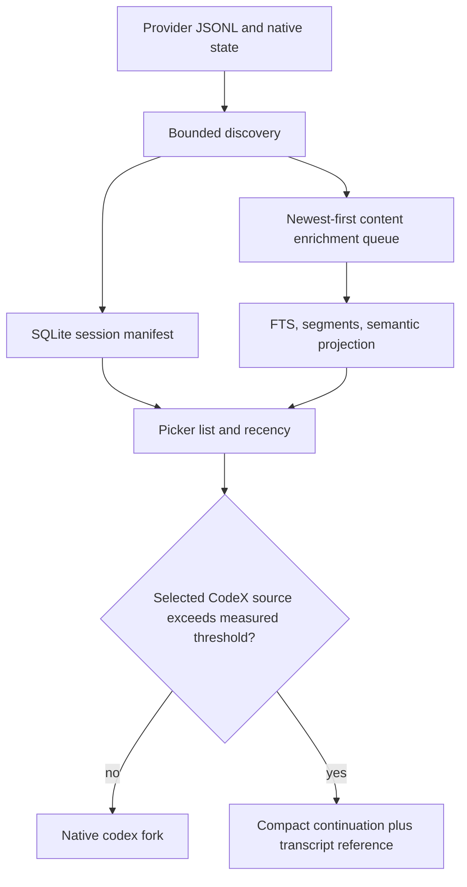

## Goal Capsule

- **Objective:** Make newly changed CodeX and Claude sessions visible promptly without waiting for full transcript indexing, and avoid multi-minute opens when a selected CodeX source transcript is extremely large.
- **Authority:** Provider-owned JSONL remains canonical. Local SQLite remains the offline query projection. Remote storage is out of scope.
- **Stop conditions:** Do not migrate transcript content to Firebase/Firestore. Do not silently substitute a compact handoff while presenting it as a native fork.
- **Execution profile:** Characterize the current failure before changing it; preserve existing provider behavior for normal-sized sessions.

---

## Product Contract

### Summary

The picker must show current session activity from a cheap metadata path even while heavyweight content enrichment is still running.
When a native CodeX fork would copy or hydrate an oversized transcript, the browser must use an explicitly labeled compact continuation path instead of appearing hung.

### Problem Frame

The current CodeX indexer fully reads changed JSONL once for metadata and again for turns before the session becomes visible.
One 5.7 GB transcript therefore blocks fresh session discovery behind minutes of unrelated historical parsing.
The picker showed an Aug 16 row for a transcript modified Aug 17, and native `codex fork` then created another 5.7 GB transcript before the new window could become useful.

### Requirements

- R1. A newly created or changed CodeX transcript must gain a visible session row from bounded metadata work without waiting for full-text or segment indexing.
- R2. The picker must order metadata discovery so newest changed sessions are surfaced before older expensive transcripts.
- R3. Content enrichment must resume safely after interruption and must not re-read unchanged transcript bytes.
- R4. A session row must expose whether search coverage is complete, partial, or pending without breaking normal picker search.
- R5. The normal selected-thread action must retain a native provider fork for sessions below a measured safety threshold.
- R6. Above that threshold, CodeX selection must start a fresh compact continuation, visibly explain why it did not issue a native fork, and retain a local reference to the canonical transcript.
- R7. A failed metadata scan, incomplete transcript line, locked SQLite database, or failed enrichment must preserve the last usable picker result and be retryable.

### Concrete Scenarios

- AE1. A CodeX session appends a new turn at 11:36 while a 2 GB historical transcript is being enriched; the next picker launch shows the 11:36 row immediately, with coverage marked pending or partial.
- AE2. A new CodeX JSONL file appears after the index starts; metadata discovery identifies its session ID, cwd, and recency before any whole-file turn parse, and blank-query results include it first.
- AE3. A normal-sized selected CodeX session launches `codex fork <id>` and retains the native fork semantics.
- AE4. A selected 5.7 GB CodeX session starts a new compact continuation with a handoff brief and transcript path rather than copying the full transcript; the terminal states that this is a compact continuation.
- AE5. An enrichment worker is interrupted after recording a byte offset; the next worker resumes from the persisted offset without duplicating indexed turns or hiding the session.
- AE6. A malformed trailing JSONL line or a locked index does not crash fzf; the prior metadata row remains searchable and enrichment retries later.

### Scope Boundaries

- **Building:** local metadata manifest, incremental local content enrichment, CodeX freshness support, large-CodeX compact continuation, and focused regression/performance tests.
- **Not building:** Firebase/Firestore transcript migration, shared multi-user transcript search, changing Codex's native fork implementation, or deleting/reformatting provider JSONL.
- **Deferred to follow-up work:** encrypted cross-device manifest/blob backup if cross-laptop search becomes a measured requirement.

### Success Criteria

- A fresh CodeX session appears in the picker before full content enrichment of unrelated large files completes.
- Refresh does not perform a full read of an unchanged transcript.
- Oversized CodeX selections become interactive through an explicit compact continuation instead of waiting for a native multi-GB fork.

---

## Planning Contract

### Key Technical Decisions

- KTD1. **Keep provider JSONL canonical and SQLite local.** The observed problem is local ingestion order and native fork cost, not lack of a cloud store; this preserves offline behavior and provider compatibility.
- KTD2. **Split manifest freshness from searchable-content enrichment.** A row becomes visible after bounded metadata extraction; FTS/segments advance independently using durable per-file state.
- KTD3. **Prioritize recency over historical completeness.** Newest changed paths receive metadata and content budget first; old giant files cannot head-of-line block current work.
- KTD4. **Use a measured compact-continuation threshold for CodeX.** The threshold is selected from a characterization benchmark of native-fork latency and source size, not guessed during planning.
- KTD5. **Preserve truthful launch semantics.** The UI and terminal say “compact continuation” whenever the native fork path is bypassed.

### High-Level Technical Design

This is directional design, not implementation code.

### Data Flow and Failure Handling

`provider session path` → bounded stat/head/tail metadata → `sessions` manifest row → picker list.
`manifest row with changed fingerprint` → durable enrichment cursor → parsed append-only turns → FTS/segment projection.
`selected CodeX row` → source-size and measured policy → native fork or compact continuation.

Every boundary must preserve a usable manifest row when its downstream work fails.

### Assumptions

- CodeX session metadata remains recoverable from a bounded prefix and/or native state row.
- The current JSONL shape is append-only enough for an offset/fingerprint resume strategy; execution must characterize rotation/truncation before relying on it.
- The threshold policy is a local UX safeguard, not a claim that CodeX can efficiently native-fork every transcript size.

### Risks and Mitigations

| Risk | Mitigation |
|---|---|
| A partial parser duplicates or misses turns after truncation | Store parser version, byte offset, and content fingerprint; reset only that session's projection when the prefix no longer matches. |
| Metadata is visible but full-text search has not caught up | Mark coverage and direct a query to priority enrichment of the selected/newest candidate. |
| Compact continuation surprises users who expect byte-identical fork history | Use explicit wording and include the canonical transcript path in the handoff brief. |
| Threshold is too low or too high | Benchmark representative small, medium, and giant CodeX sessions before setting it; keep it configurable while collecting local timing evidence. |

---

## Implementation Units

### U1. Characterize provider metadata and native-fork cost

- **Goal:** Establish the measured boundary and transcript mutation behavior that later units depend on.
- **Requirements:** R1, R3, R5, R6.
- **Files:** `claude_browse/providers/codex.py`, `claude_browse/fts.py`, `tests/test_codex_provider.py`, `tests/test_browse.py`.
- **Approach:** Add deterministic fixtures representing a fresh file, appended file, malformed tail, truncated/replaced file, and a large-file surrogate. Add a benchmark harness or opt-in diagnostic that records metadata extraction time, content parse time, and native-fork launch time without copying real user transcripts.
- **Test scenarios:** Verify metadata extraction never reads the fixture's full body; verify append and replacement fingerprints differ; verify the policy tests can select native versus compact launch from measured fixture metadata.
- **Verification:** Focused provider and browse tests demonstrate each mutation shape and record a reproducible threshold-selection input.
- **Dependencies:** None.

### U2. Add a durable session manifest and bounded CodeX freshness path

- **Goal:** Commit fresh identity, cwd, recency, size, fingerprint, and coverage before content indexing.
- **Requirements:** R1, R2, R4, R7.
- **Files:** `claude_browse/fts.py`, `claude_browse/providers/codex.py`, `claude_browse/providers/claude.py`, `tests/test_fts.py`, `tests/test_codex_provider.py`.
- **Patterns:** Follow the bounded Claude live-activity reader and current SQLite schema migration/versioning patterns; extend them provider-neutrally rather than special-casing picker formatting.
- **Approach:** Separate provider discovery metadata from full transcript turns, enumerate changed paths by recency, and upsert manifest/session metadata in short transactions. Preserve prior rows when metadata is unreadable.
- **Test scenarios:** A new CodeX path appears while an old large path remains pending; its row is returned by recent-list queries. A known CodeX path with a newer mtime updates recency without full parse. A bad tail leaves the previous manifest row intact. Claude behavior remains unchanged.
- **Verification:** `tests/test_fts.py` and `tests/test_codex_provider.py` prove bounded reads, newest-first visibility, and rollback-safe failures.
- **Dependencies:** U1.

### U3. Make content enrichment incremental, resumable, and priority-aware

- **Goal:** Populate searchable content without blocking manifest visibility or repeatedly parsing giant append-only histories.
- **Requirements:** R2, R3, R4, R7.
- **Files:** `claude_browse/fts.py`, `claude_browse/providers/codex.py`, `claude_browse/browse.py`, `tests/test_fts.py`, `tests/test_browse.py`.
- **Approach:** Persist per-session content cursor/fingerprint/coverage state, process newest changed rows first, commit progress independently, and schedule bounded retry after parse/lock failures. Keep existing FTS, segment, and semantic ranking contracts for complete rows.
- **Test scenarios:** Interrupt after one batch and resume without duplicate segments. An old large session stays pending while a newer small session becomes searchable. An empty or malformed tail does not make fzf emit an error. A query against a pending candidate has defined degraded behavior.
- **Verification:** Targeted tests assert cursor progression, deduplication, queue ordering, and preserved existing search results.
- **Dependencies:** U2.

### U4. Introduce truthful compact continuations for oversized CodeX sources

- **Goal:** Preserve default fork behavior for normal threads while avoiding native multi-GB forks that block a new window.
- **Requirements:** R5, R6, R7.
- **Files:** `claude_browse/browse.py`, `claude_browse/core.py`, `claude_browse/providers/codex.py`, `tests/test_browse.py`, `tests/test_core.py`.
- **Approach:** Apply the measured policy from U1 at the native CodeX launch boundary. Route oversized sources through the existing import/handoff machinery, include a canonical transcript reference, and print an explicit compact-continuation explanation. Preserve explicit `--no-fork` behavior and normal native fork commands below threshold.
- **Test scenarios:** A source below threshold executes `codex fork`. A source above threshold creates a fresh CodeX continuation and does not invoke native fork. The handoff includes the source path and a clear compact-continuation label. Missing source metadata falls back safely to current native behavior or a documented warning.
- **Verification:** Browse/core tests assert command selection, terminal wording, and handoff content.
- **Dependencies:** U1, U2.

### U5. Surface freshness and coverage state in picker and operational diagnostics

- **Goal:** Make delayed enrichment observable instead of presenting stale data as complete.
- **Requirements:** R1, R4, R7.
- **Files:** `claude_browse/browse.py`, `claude_browse/web.py`, `claude_browse/webassets/app.js`, `README.md`, `tests/test_browse.py`, `tests/test_web.py`.
- **Approach:** Add concise row/preview state for pending or partial coverage, retain the last known timestamp, and document the distinction between native fork and compact continuation.
- **Test scenarios:** Pending session appears with current metadata; complete session rendering remains unchanged; web API exposes coverage state without loading the full transcript; failed worker state gives a retry-safe message.
- **Verification:** Picker formatting and web tests cover state rendering and backward-compatible API fields.
- **Dependencies:** U2, U3, U4.

---

## Verification Contract

| Scope | Proof |
|---|---|
| Metadata freshness | `tests/test_codex_provider.py` and `tests/test_fts.py` verify fresh/new CodeX rows are visible before full turn parsing. |
| Incremental correctness | `tests/test_fts.py` verifies append, interruption, replacement, and duplicate-prevention behavior. |
| Picker behavior | `tests/test_browse.py` verifies normal native forks, oversized compact continuations, and truthful status text. |
| Handoff fidelity | `tests/test_core.py` verifies a compact continuation carries a canonical transcript reference and recent context. |
| Browser/API state | `tests/test_web.py` verifies coverage/freshness fields do not require full transcript loading. |
| Regression suite | Run the repository's complete pytest suite after all focused tests pass. |
| Manual performance check | On the real corpus, record picker time-to-first-fresh-row and compare native-fork versus compact-continuation launch time for representative session sizes. |

---

## Definition of Done

- U1 establishes a reproducible threshold policy from measured behavior rather than a guessed byte count.
- Newly changed CodeX sessions show current recency before full content enrichment finishes.
- Enrichment is restart-safe, preserves prior usable rows on failure, and avoids re-reading unchanged transcript bytes.
- Large CodeX selections do not invoke an opaque multi-gigabyte native fork; users see an explicit compact continuation with access to canonical history.
- Normal-sized CodeX sessions retain native fork behavior.
- All focused tests and the full repository suite pass, and any abandoned experimental parsing path is removed.
