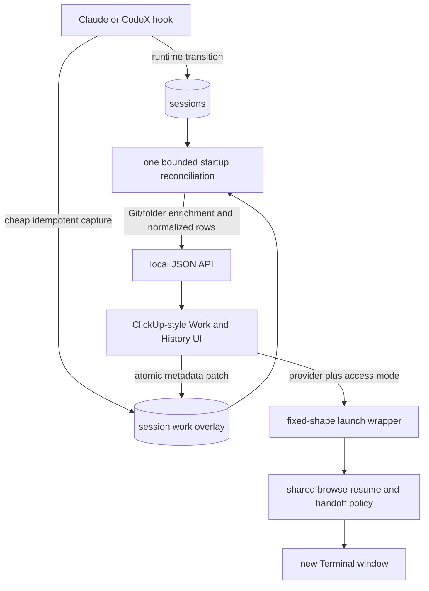
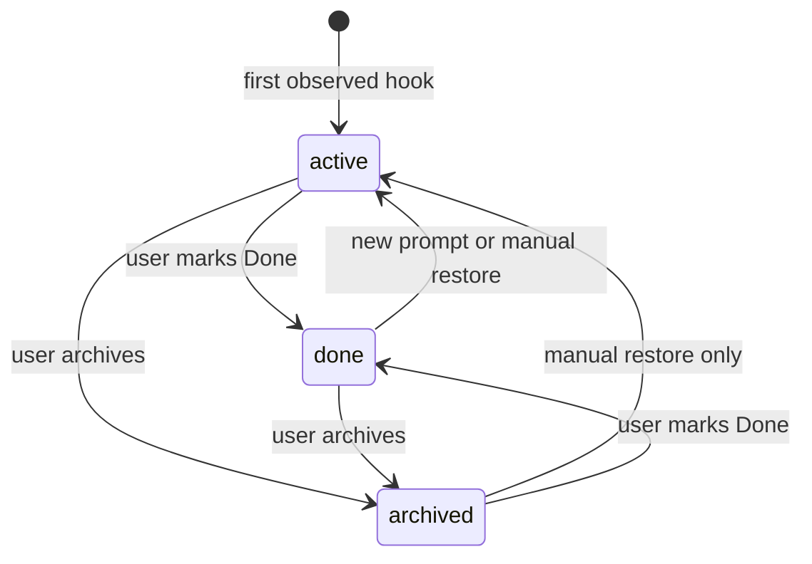
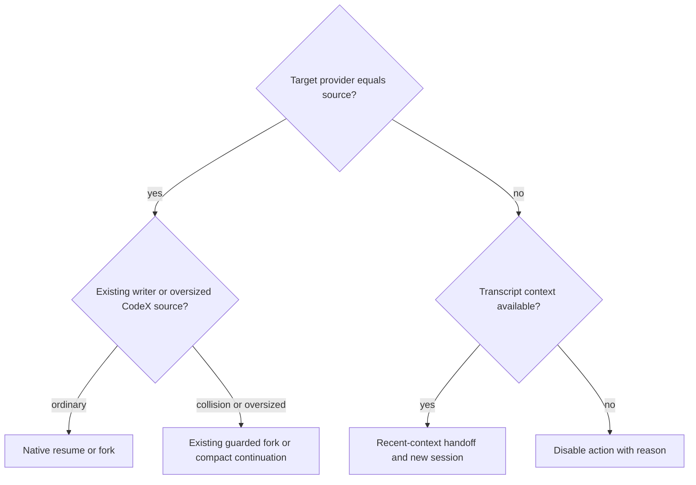

# Automatic Terminal Thread Board - Plan

## Goal Capsule

- **Objective:** Shamanth can open one familiar list, see every Claude and CodeX terminal thread as actionable work, decide what matters today, and resume it without manually creating tasks.
- **Means:** Extend the local Agent Board with an automatic session-backed work overlay, ClickUp-style list views, and provider-aware Terminal launch actions (KTD1-KTD5).
- **Authority:** The Product Contract defines behavior. Key Technical Decisions define implementation. Existing transcript/resume safety behavior remains authoritative where this plan does not replace it.
- **Stop conditions:** Stop if automatic enrollment requires network work or Git subprocesses in hooks, if a user edit can be overwritten by runtime events, or if launch bypasses existing active-writer and large-session safeguards.
- **Execution profile:** Complete all units, preserve existing security controls, run the full suite, and validate the real browser and Terminal flows.
- **Tail ownership:** Update the stacked pull request, wait for CI, and report any remaining cross-Mac work separately.

---

## Product Contract

### Summary

Every newly observed terminal conversation becomes one active row automatically unless that same row was explicitly Archived. The local web interface presents those rows as a dense task list with project grouping, due dates, editable names, reversible completion, transcript review, and safe or full-access provider launch actions.

### Problem Frame

The current opt-in queue creates a second job: the user must decide which conversations deserve tracking and manually add them before the board can prevent work from being forgotten. This defeats the purpose of a terminal project-management layer. The interface also resembles a custom dashboard more than the dense ClickUp list the user already knows how to scan.

### Key Decisions

- **Automatic opt-out enrollment** (session-settled: user-directed — chosen over manually adding selected threads: manual capture makes maintaining the queue into its own project). Governs R1, R2, R5.
- **One terminal session is one task row** (session-settled: user-directed — chosen over classifiers that exclude subagents, probes, or automated sessions: the user defines the unit as a conversation opened in a terminal). Governs R1, R2, R8.
- **Dense ClickUp-style list** (session-settled: user-directed — chosen over a card dashboard: the familiar list shape is faster to review and manage). Governs R4, R5, R6.
- **Project identity starts from the repository or folder** (session-settled: user-approved — chosen over a separate project-management taxonomy: repository grouping is useful immediately and does not require setup). Governs R3.
- **Local-first control surface** (session-settled: user-approved — chosen over hosting transcript and Terminal control in Mission Control now: the session files and executable processes live on each Mac). Governs R7, R9.

### Requirements

**Automatic capture and identity**

- R1. Each hook-observed Claude or CodeX terminal session has exactly one work row without any Add or Save action.
- R2. Automatic enrollment is content-agnostic and preserves one row per session even when several sessions share a folder.
- R3. Each row groups under a stable Git-origin project when available and otherwise under its canonical folder, while retaining the session's exact working directory for launch.
- R4. Each row has an automatically improving title until the user renames it. User title and due date always persist; Archived persists until manual restoration; Done is a soft completion that returns to Active only when the same session receives a new prompt.

**Review and planning**

- R5. The board opens to Active on every fresh page load and provides Active, Today, By Project, and Done & Archived views plus the existing searchable Thread History.
- R6. The default presentation is a dense list with scannable columns for name/project, due date, explicitly labeled Work status, explicitly labeled Terminal state, provider, recent activity, and actions.
- R7. Done and Archived remove a row from active planning, remain reversible, and stop unattended-completion reminders for that session.

**Resume and continuation**

- R8. Each row and Thread History detail can open Claude or CodeX in a new Terminal window. One visible global Full access toggle, on by default, controls both providers; turning it off launches safe mode. Every API request must carry an actual boolean; omission or any non-boolean fails closed. Source-provider actions say Resume and other-provider actions say Continue in.
- R9. Same-provider launch uses the established native resume/fork policy; cross-provider launch creates a new recent-context continuation and therefore a new automatically captured row without mutating the source row.
- R10. A missing provider binary, exact working directory, or cross-provider transcript disables only the affected action and explains why; the row remains visible.

**Safety and compatibility**

- R11. Hook capture remains local, synchronous, failure-isolated, and free of Git or network subprocesses.
- R12. Loopback binding, Host validation, per-server request tokens, JSON-only writes, CSP, server-built commands, and AppleScript argv isolation remain enforced.
- R13. Existing linked rows migrate idempotently without losing timestamps, titles, or due dates: old titles are treated as manual overrides, `todo`/`waiting` become Active, and `done`/`archived` retain their meaning. Sessionless rows remain stored but hidden and inert; rejected standalone-task behavior is removed from the active API and UI.

### Concrete Scenarios

- **S1 — automatic happy path:** A new CodeX terminal session starts in a repository, the hook records it immediately, and the board shows one Active row without user action. The first meaningful prompt improves the automatic title.
- **S2 — planning:** The user renames the row and sets tomorrow as its due date. Later prompt, stop, naming, and session-end events update runtime state but keep the edited title and date.
- **S3 — today review:** Today shows active rows that need input, have an unattended completion, are overdue, or are due today. Future and undated quiet work stays in Active and By Project.
- **S4 — reversible removal:** The user marks a row Done or Archived. It leaves active views and stops reminder publication. Restoring Active returns it with its title, project, and due date intact.
- **S4a — resumed work:** Reading History does not change work state. Sending a new prompt in a Done terminal thread returns it to Active; sending a new prompt in an Archived thread leaves it Archived.
- **S5 — launch:** A source-provider action follows native collision and large-session policy. An other-provider action creates a recent-context continuation, and its destination hook adds a separate row.
- **Edge — delayed index:** A hook-only row not yet present in the FTS index can still launch its source provider; its cross-provider action is disabled until transcript context is available.
- **Failure — capture enrichment:** Git discovery is slow or fails. The hook still returns promptly and the row appears with folder fallback; web-side enrichment may improve project identity later.
- **Failure — unavailable machine state:** A row refers to a directory or provider missing on this Mac. Review and metadata editing still work, but launch shows a precise unavailable reason.

### Scope Boundaries

**Building now**

- Automatic session-backed rows, sparse user metadata, dense local list views, deterministic ordering, simple Work text search, Work-only metadata editing, and safe/full-access Terminal actions from Work and History.
- Removal of manual Add/Save and standalone-task branches from the active product surface.
- Documentation, migrations, unit/integration coverage, browser QA, and real Terminal smoke verification.

#### Deferred to Follow-Up Work

- Cross-Mac task metadata sync and Mission Control rendering. Future cloud metadata needs separate ownership and conflict rules so hook sync cannot overwrite remote edits.
- Hosted transcript reading or remote Terminal control. Local transcripts and local execution remain on each Mac.
- Priorities, assignees, subtasks, dependencies, recurrence, estimates, comments, calendar integration, and AI extraction of future actions.

### Success Criteria

- A fresh Claude and a fresh CodeX terminal session each appear on the board without any queue action.
- A morning review can identify attention, due work, project context, and resume actions from one dense screen.
- No hook event performs Git/network work or loses its runtime transition when overlay capture fails.
- Title is canonical across the Work list, statusline, CLI board, notifications, and synced live-state name; due date and work status are consistent within the local Work surface. Thread History remains transcript-and-launch only, and cross-Mac work metadata is explicitly deferred.
- Same-provider and cross-provider launches remain truthful and retain the repository's collision, large-session, and security protections.

---

## Planning Contract

### Key Technical Decisions

- KTD1. **Store a sparse session-backed overlay.** Keep runtime truth in `sessions`; keep user-owned work status, due date, and title override in the existing SQLite work table keyed one-to-one by session. Delete active support for sessionless work. (session-settled: user-directed — chosen over standalone tasks and opt-in linking: R1 and R2 make the session the task.)
- KTD2. **Keep capture cheap and enrich outside hooks.** Hook capture inserts only values already in the payload/runtime row. Git-origin resolution and legacy projection run from bounded web-side reconciliation, never the hook path. (session-settled: user-approved — chosen over hosted or network-dependent capture: R11 requires local reliability.)
- KTD3. **Make the user rename canonical.** Automatic titles resolve from runtime/provider names until a title override exists. A user rename also marks runtime naming manual so namers, notifications, statusline, CLI, and Slack cannot diverge.
- KTD4. **Reuse launch orchestration.** Add an effectful direct-session CLI entry that calls the existing `browse.py` resume/continuation path inside the new Terminal; the web server builds and opens only that fixed-shape wrapper command. This preserves provider availability checks, active-writer policy, exact cwd, and the oversized CodeX compact-continuation guard without duplicating process probes or import creation in the web process.
- KTD5. **Separate work state from runtime state.** Persistent work state is `active`, `done`, or `archived`; live runtime state remains `working`, `idle`, `needs-input`, `gone`, or `ended`. Done reopens to Active on a new prompt; Archived is the durable opt-out until manually restored.
- KTD6. **Own deterministic list semantics in Python.** The API emits normalized rows and sort keys; the no-build JavaScript handles local view selection, project grouping, and one text search across title, project, provider, and session ID without reinterpreting lifecycle rules.
- KTD7. **Preserve local security boundaries.** All launch commands remain server-built and request-token protected. The browser never submits executable command text as authority.
- KTD8. **Make work edits atomic and ordered.** Service-level mutations validate first, then update the overlay and any canonical runtime title/acknowledgment in one SQLite transaction. Publication starts only after commit; any validation or database failure leaves both representations unchanged. The browser serializes mutations per row so an earlier slow PATCH cannot overwrite a later edit.
- KTD9. **Keep the existing local trust and privacy boundary explicit.** The loopback token protects against browser CSRF/rebinding; it is not authentication against another process running as the Mac user, which this single-user local tool trusts. Only the existing runtime live-state projection may leave the Mac: provider, session ID, runtime state, timestamps, cwd/machine metadata, and canonical display name already used by notifications/Slack. Transcript text, due dates, work status/archive metadata, and continuation briefs remain local and are excluded from Firestore/Slack serialization.

### High-Level Technical Design

### Data Flow and Failure Handling

1. Hook payload (`session_id`, provider, cwd, prompt/runtime fields) updates the runtime row and idempotently creates the sparse overlay.
2. At web-server startup, one atomic, idempotent `INSERT ... SELECT`-equivalent reconciliation creates overlays for existing runtime rows. Board GETs are read-only. Git-origin enrichment is cached per exact cwd and falls back immediately to the folder.
3. A metadata patch validates title, date, and work status, then commits overlay plus canonical runtime title/acknowledgment atomically; closing work schedules best-effort publication only after commit. The client serializes pending edits per row.
4. A launch request requires the target provider and a JSON boolean access mode; omitted, null, string, or numeric modes fail closed. It builds a fixed direct-session CLI wrapper, then passes it to Terminal as argv data. The CLI performs the existing effectful resume/continuation policy.
5. Any failed enrichment, index lookup, provider check, or Terminal request returns a scoped error and leaves work/runtime state unchanged.

### Assumptions

- Existing Agent Board `sessions` rows represent the terminal sessions eligible for initial bounded reconciliation; the older transcript-only FTS archive remains Thread History rather than becoming an artificial active backlog.
- Cross-provider continuation intentionally leaves the source row active because it creates a distinct terminal conversation under R2 and R9.
- One text search is included for large automatic backlogs; By Project supplies project navigation and provider-specific filtering is deferred until usage proves it necessary.
- Runtime work marked Done becomes Active when a new prompt proves work resumed; Archived remains manual until restored.

### Integration Map

- `hook.py` -- session/runtime dictionaries --> `store.py` and `work_items.py`
- `store.py` + `work_items.py` -- normalized joined row --> `web.py`
- `web.py` -- JSON task/session metadata --> `webassets/app.js`
- `web.py` -- provider/access/session request --> `commands.py` fixed wrapper --> direct-session CLI --> shared `browse.py` launch policy
- `work_items.py` -- canonical manual title/closure acknowledgment --> `naming.py`, `statusline.py`, `cli.py`, and `sync.py` through the shared runtime row

### Pre-Mortem

- **Most likely failure:** the board fills with folder-named rows because the first automatic title is frozen. KTD3 and U1 require an override model and title-upgrade tests.
- **Second most likely:** a web resume opens Terminal but the CLI immediately fails on an active writer or giant CodeX session. KTD4 and U3 reuse the established guarded launch path.
- **Sneaky failure:** marking work Done hides the row locally while Slack keeps nagging because runtime attention was not acknowledged. U2 makes closure and publication one tested service operation.

---

## Implementation Units

### U1. Replace opt-in tasks with a session-backed work overlay

- **Goal:** Capture every observed session once without slowing hooks, and preserve canonical user metadata.
- **Requirements:** R1-R4, R11, R13; KTD1-KTD3, KTD5.
- **Dependencies:** None.
- **Files:** `claude_browse/board/store.py`, `claude_browse/board/work_items.py`, `claude_browse/board/hook.py`, `claude_browse/board/naming.py`, `tests/test_board_store.py`, `tests/test_board_hook.py`, `tests/test_board_work_items.py`, `tests/test_board_naming.py`.
- **Approach:** Before the first new-schema migration, create a one-time SQLite backup beside the database. In one rollback-safe transaction, add overlay fields for title source/override and exact session cwd, then migrate linked rows idempotently: preserve timestamps/due dates, treat every legacy title as manual, map `todo`/`waiting` to Active, preserve `done`/`archived`, fill exact cwd from `sessions.cwd` with the old project path only as fallback, and leave unknown sessionless rows stored but hidden/inert. Delete the exact known development-only row during cleanup. Provide a no-subprocess idempotent capture path used by SessionStart and UserPromptSubmit. Make automatic naming writes conditional on the source/revision they read and re-check `name_source != manual` at commit so an in-flight namer cannot overwrite a user rename. Preserve Archived on hooks and reactivate Done only on UserPromptSubmit.
- **Execution note:** Start with lifecycle and no-subprocess regression tests before modifying hook capture.
- **Patterns to follow:** WAL/idempotent migration in `store.py` and hook fail-open behavior in `hook.main`. Manual-name protection does not exist yet and must be added explicitly in `naming.maybe_name`.
- **Test scenarios:**
  - SessionStart and UserPromptSubmit each create the same single row under repeated and concurrent delivery.
  - Hook capture executes no Git or network subprocess and still records/schedules the runtime transition if overlay capture fails.
  - SessionStart folder title upgrades after the first prompt and later namer result.
  - User rename, due date, and status survive all later hook and naming events.
  - A paused in-flight namer loses its guarded write when a manual rename commits first.
  - Done plus UserPromptSubmit becomes Active; Archived plus any runtime hook remains Archived.
  - A legacy-database fixture covers linked edits, legitimate sessionless rows, the exact prototype row, missing/older columns, `waiting`, `done`, and `archived`; an injected migration failure rolls back and the backup restores byte-equivalent logical rows.
  - A nested session cwd remains distinct from its Git grouping root.
- **Verification:** Focused board store/hook/naming tests pass; a structural test forbids subprocess/Git/network calls from capture; 50 warm temporary-DB hook dispatches have p95 below 100 ms and the cold first dispatch stays below 500 ms.

### U2. Normalize board API, lifecycle, and project reconciliation

- **Goal:** Return a complete, deterministic board without unbounded mutation on every GET.
- **Requirements:** R3-R7, R10, R12, R13; KTD2, KTD5-KTD7.
- **Dependencies:** U1.
- **Files:** `claude_browse/board/projects.py`, `claude_browse/board/work_items.py`, `claude_browse/web.py`, `tests/test_board_work_items.py`, `tests/test_web.py`.
- **Approach:** Join session and overlay state in one normalization path. At server startup, run one atomic/idempotent bulk reconciliation for `sessions` rows missing overlays; never backfill from GET and never enroll old FTS-only History. Cache Git resolution per exact cwd outside hooks with immediate folder fallback. Return explicit work/runtime fields, action availability/reasons, and deterministic ordering. Service PATCH validates then atomically updates overlay plus runtime title/ack/revision; sync publication begins only after commit. Stop handling consults local work state: Done/Archived sessions finish runtime state already acknowledged and cannot create unattended markers; Done followed by a new prompt intentionally reactivates and restores normal Stop behavior. Delete dead attention/manual-create/queued-task API branches.
- **Patterns to follow:** `_host_allowed`, `_mutation_allowed`, `_read_json`, and server-side command construction in `web.py`; origin normalization in `projects.py`.
- **Test scenarios:**
  - Every eligible runtime row appears once; Done and Archived membership is correct and reversible.
  - Today contains attention, unattended, overdue, and due-today Active rows while excluding future, quiet undated, and closed rows.
  - Closing a row acknowledges unattended state and schedules publication; reopening does not fabricate attention.
  - Done-during-working then Stop and Archived-during-working then Stop remain acknowledged; Done then new prompt then Stop can produce a new unattended completion.
  - SSH and HTTPS forms of one origin group together, nested worktrees retain exact cwd, and Git failure falls back to folder identity.
  - Missing cwd/transcript/provider affects only its launch action and never hides or mutates the row.
  - Invalid dates/statuses/titles and hostile mutation requests preserve the existing HTTP security responses.
  - Firestore/Slack serialization includes only the established live-state projection and excludes transcript, due date, work status/archive fields, and continuation briefs.
- **Verification:** HTTP integration tests prove normalized board output, lifecycle effects, deterministic order, and security boundaries.

### U3. Share guarded launch planning with the web interface

- **Goal:** Make every Work and History launch truthful, provider-aware, and safe/full-access selectable.
- **Requirements:** R8-R10, R12; KTD4, KTD7.
- **Dependencies:** U1, U2.
- **Files:** `claude_browse/browse.py`, `claude_browse/board/commands.py`, `agent-board`, `claude_browse/web.py`, `tests/test_browse.py`, `tests/test_board_work_items.py`, `tests/test_web.py`.
- **Approach:** Capture provider transcript path in local runtime state and expose a direct-session command that runs inside the new Terminal and calls/reuses the existing native/cross-provider orchestration. Even before FTS indexing, source launch derives transcript size from that path and runs active-writer detection; only cross-provider continuation is disabled if transcript parsing is unavailable. The web path constructs only this fixed wrapper and checks enough local prerequisites to label actions truthfully. Preserve active-writer fork behavior, oversized CodeX compact continuation, exact cwd, binary checks, and recent-context import. Remove standalone start commands.
- **Execution note:** Characterize existing picker behavior first; the web path must call the same policy rather than copy it.
- **Patterns to follow:** `_native_resume`, `_continue_in_provider`, `_session_holder`, provider specs, and import-file generation in `browse.py`.
- **Test scenarios:**
  - Source-provider dormant sessions use the native command with the selected safe/full flag.
  - An active writer follows existing fork/fail behavior rather than attempting a blind second attach.
  - Oversized CodeX sources take the established compact-continuation path.
  - Claude-to-CodeX and CodeX-to-Claude actions are labeled and executed as new context continuations.
  - A hook-only row permits source resume but disables cross-provider handoff until context is available.
  - Hook-only active-writer and oversized-CodeX sessions take the same guarded paths as indexed sessions.
  - Missing binary/cwd and AppleScript failure return actionable errors without changing work state.
  - Client-supplied command text is ignored and unsafe characters remain argv data.
- **Verification:** Browse, command, and live HTTP launch tests prove parity with picker behavior; one harmless real Terminal smoke opens successfully.

### U4. Deliver the dense ClickUp-style Work and History experience

- **Goal:** Make the board immediately scannable and editable in the familiar list form.
- **Requirements:** R4-R8, R10; KTD5-KTD7.
- **Dependencies:** U2, U3.
- **Files:** `claude_browse/webassets/index.html`, `claude_browse/webassets/app.js`, `claude_browse/webassets/app.css`, `claude_browse/web.py`, `tests/test_web.py`.
- **Approach:** Replace task cards with a semantic, keyboard-operable, column-aligned list; open on Active; add Active/Today/By Project/Done & Archived navigation and one local text search. Keep title/date/status editing only in Work. Keep History focused on transcript review and launch, including FTS-only sessions. Serialize PATCH operations per row and flush a pending debounce before navigation/unload. Add one visible global `Full access (skip permissions)` toggle, on by default, used by both provider buttons on both surfaces. Label source actions `Resume Claude/CodeX` and cross-provider actions `Continue in Claude/CodeX`; show disabled reasons adjacent or via accessible descriptions. At narrow widths, wrap actions below each row.
- **Patterns to follow:** Existing vanilla DOM construction, debounced writes, focused-field refresh guard, and no-network asset policy.
- **Test scenarios:**
  - View membership and deterministic ordering match API semantics across all work/runtime combinations.
  - Active is the default view; search finds manual/automatic title, project, provider, and session ID without changing stored data.
  - Work edits update their canonical fields; History never creates or edits work overlays.
  - Safe actions omit bypass flags; Full Access actions add the correct provider flag on both surfaces.
  - Launch requests with omitted, null, string, or numeric access modes are rejected and never add a bypass flag.
  - Focused, pending, or failed edits are not overwritten by the ten-second refresh. A failed save retains the attempted value, marks the control invalid, announces an aria-live error, and retries on the next edit; success clears the error.
  - Reversed network response timing cannot reorder two edits to one row, and a pending debounced edit is flushed before navigation.
  - Missing actions are disabled with a visible reason and the rest of the row remains usable.
- **Verification:** JavaScript syntax passes and browser QA confirms semantic labels, keyboard/focus behavior, desktop density, responsive behavior, edits, search, views, transcript reading, and both access modes.

### U5. Align documentation and remove migration residue

- **Goal:** Leave one understandable product model and an accurate operator handoff.
- **Requirements:** R1-R13.
- **Dependencies:** U1-U4.
- **Files:** `README.md`, `CHANGELOG.md`, `tests/test_readme.py`.
- **Approach:** Document automatic capture, persistent/runtime state separation, project identity, all views, safe/full launch semantics, local-only metadata, and cross-Mac limitations. Remove manual Add/Save and standalone task API instructions. Delete dead code and the known prototype-only local row created during development.
- **Test scenarios:**
  - README command/API examples match implemented routes and access-mode wording.
  - Documentation clearly distinguishes native resume from cross-provider continuation.
  - Documentation states that the request token is a browser CSRF/rebinding control, same-user local processes are trusted, and work metadata/transcripts stay local.
  - No production or test reference retains the rejected manual-task or task-link environment model.
- **Verification:** Documentation tests, repository searches, and diff review show a single session-is-task model with no test artifacts.

---

## Verification Contract

| Surface | Verification | Done signal |
|---|---|---|
| Data and hooks | `pytest tests/test_board_store.py tests/test_board_hook.py tests/test_board_naming.py tests/test_board_work_items.py` | Automatic capture, title authority, lifecycle, concurrency, and hot-path isolation pass. |
| Launch policy | `pytest tests/test_browse.py tests/test_board_work_items.py tests/test_web.py` | Native/cross-provider, collision, large CodeX, safe/full, and security cases pass. |
| Full repository | `pytest` and `ruff check .` | All tests and lint pass with no unrelated regression. |
| Static web | `node --check claude_browse/webassets/app.js` and `git diff --check` | JavaScript parses and the diff has no whitespace damage. |
| Browser | Run the local server and exercise Work and Thread History in Chrome at desktop and narrow widths | Active opens by default; work/runtime columns remain distinct; automatic rows, dense views, search, edits/error states, keyboard focus, disabled reasons, transcript, and access controls work visibly. |
| Terminal | Launch one harmless same-provider test action through the actual macOS integration | A new Terminal window opens through argv-safe AppleScript and invokes the guarded agent-board launch path. |
| Shipping | Pull-request CI reaches a terminal successful state | The stacked PR is reviewable, green, and contains the plan, code, tests, and docs. |

### Earned Confidence Scorecard

| Section | Read every affected file | Exact data trace | Signatures/contract known | Failure behavior known | Tests writable now | Earned score |
|---|---:|---:|---:|---:|---:|---:|
| Session overlay and hooks | 20 | 20 | 20 | 20 | 20 | 100/100 |
| API and lifecycle | 20 | 20 | 20 | 20 | 20 | 100/100 |
| Resume and continuation | 20 | 20 | 20 | 20 | 20 | 100/100 |
| Web experience | 20 | 20 | 20 | 20 | 20 | 100/100 |
| Integration | 20 | 20 | 20 | 20 | 20 | 100/100 |

The overall confidence is 100/100 because the lowest section score is 100. Repository research exposed the weak paths before implementation and each now has an owning unit and concrete failure test.

---

## Definition of Done

- Every hook-observed Claude and CodeX session is represented once without manual creation or hook latency regression.
- Title is canonical on every local/live-name surface; due date and work status are user-owned and consistent in local Work. Cross-Mac work metadata remains explicitly deferred.
- The UI is a dense list with the specified views, text search, Work-only inline edits, distinct work/runtime columns, accessible state, and provider/access actions.
- Launch behavior reuses established native/cross-provider safety policy and handles missing prerequisites truthfully.
- All focused, full-suite, lint, static, browser, Terminal, and CI checks pass.
- README and changelog describe only the shipped automatic model.
- Dead standalone-task code, obsolete API fields, abandoned approaches, and development-only data are removed.
